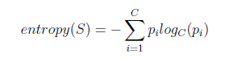

## Task: To implement Decision Tree using ID3 Algorithm:

 

####where pi is the proportion of class i (with C being all classes in the data set). Use Information Gain as your decision measure and treat all features as discrete multinomial distributions.Given are the two data sets named car and nursery as csv files. Your program should be able to read both data sets and treat the last value of each line as the class. Your task is to correctly implement the ID3 algorithm and return the final tree without stopping early (both data sets can be learned perfectly, i.e. all leaves have an entropy of 0). The output of your algorithm should look like the example XML solution given for the car data set. With that, you can check the correctness of your solution. All features are unnamed on purpose, please number them according to the column starting from 0 (e.g. att0). For each data set, you can acquire one point, if the solution of your program returns correct results. If the program fails, the data format is incorrect or I have to change source code, in order to make it work, you will get zero points. Machine learning libraries are not allowed. You can use libraries for handling the XML format and the input parameters. Your program must accept the following parameters:

####1. data - The location of the data le (e.g. /media/data/car.csv).
####2. output - Where to write the XML solution to (e.g. /media/data/car solution.xml).
